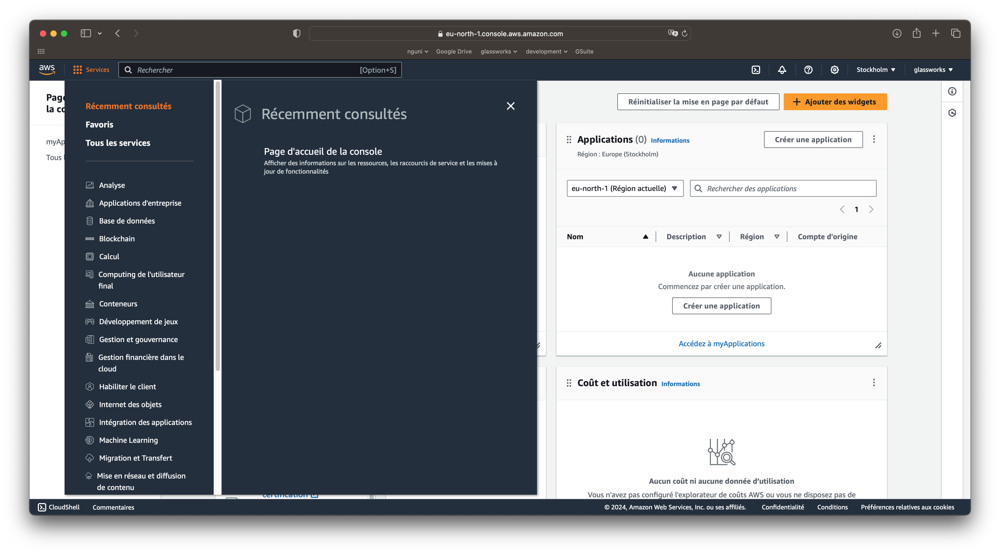
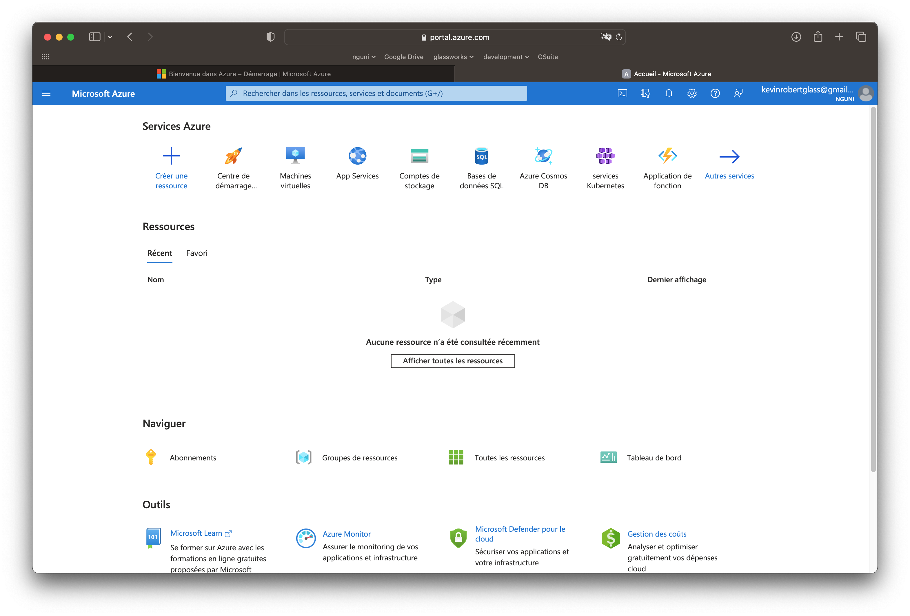
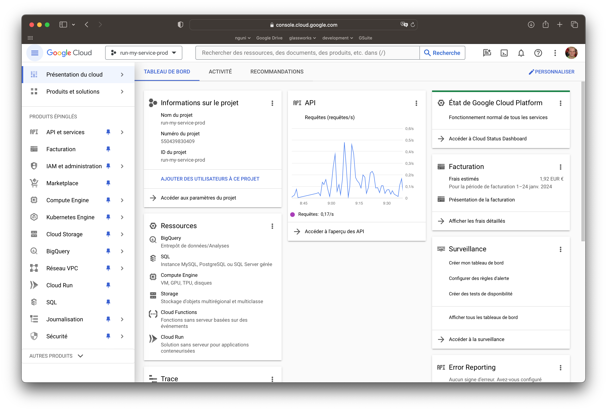
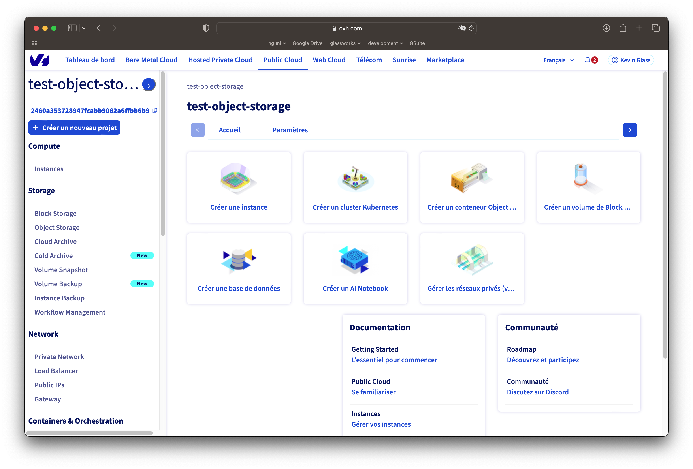
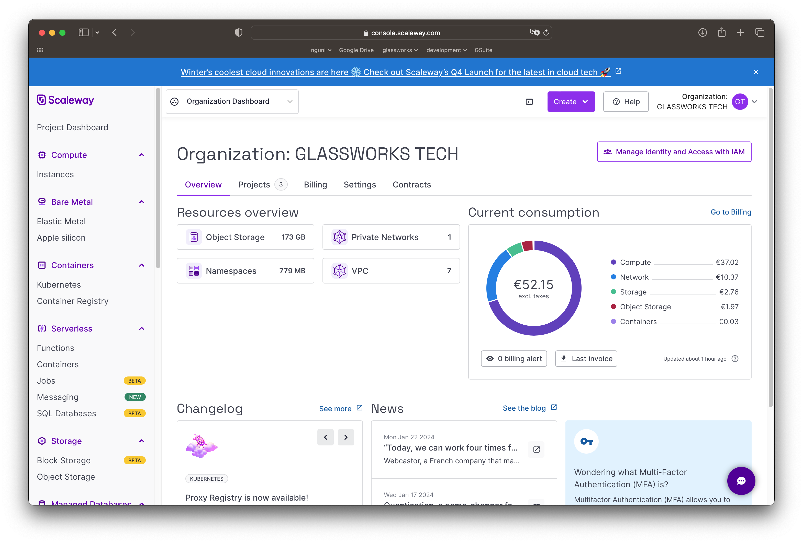

# Fournisseurs cloud

Il existe aujourd'hui sur le marché de nombreux fournisseurs Cloud, qu'ils soient internationaux ou français.

## AWS - Amazon Web Services

- Éventail large et complet : IaaS, PaaS, FaaS, SaaS
- Prise en main relativement difficile
- Siège aux USA, data-centers en Europe
- [Lien vers AWS](https://aws.amazon.com/fr/)

<figure><figcaption>
Tableau de bord AWS
</figcaption></figure>

## Azure - Microsoft

- Éventail large et complet : IaaS, PaaS, FaaS, SaaS
- Prise en main relativement difficile
- Siège aux USA, data-centers en Europe
[Lien vers Azure](https://azure.microsoft.com/fr-fr)

<figure><figcaption>
Tableau de bord Azure
</figcaption></figure>

## GCP - Google Cloud Platform

- Éventail large et complet : IaaS, PaaS, FaaS, SaaS
- Prise en main relativement difficile
- Siège aux USA, data-centers en Europe
[Lien vers GCP](https://console.cloud.google.com)

<figure><figcaption>
Tableau de bord GCP
</figcaption></figure>

## 🇫🇷 OVH

- Éventail : IaaS, PaaS
- Prise en main relativement difficile
- Siège en France
[Lien vers OVH](https://www.ovh.com/)

<figure><figcaption>
Tableau de bord Public Cloud de OVH
</figcaption></figure>

## 🇫🇷 Scaleway

- Éventail : IaaS, PaaS, FaaS
- Prise en main relativement facile
- Siège en France
[Lien vers Scaleway](https://console.scaleway.com/)

<figure><figcaption>
Tableau de bord Scaleway
</figcaption></figure>

## ... et beaucoup d'autres

Il existe de nombreux autres fournisseurs qui proposent IaaS, FaaS, PaaS en fonction de vos besoins :
- Heroku (PaaS) : https://www.heroku.com/
- DigitalOcean : https://www.digitalocean.com/
- ...