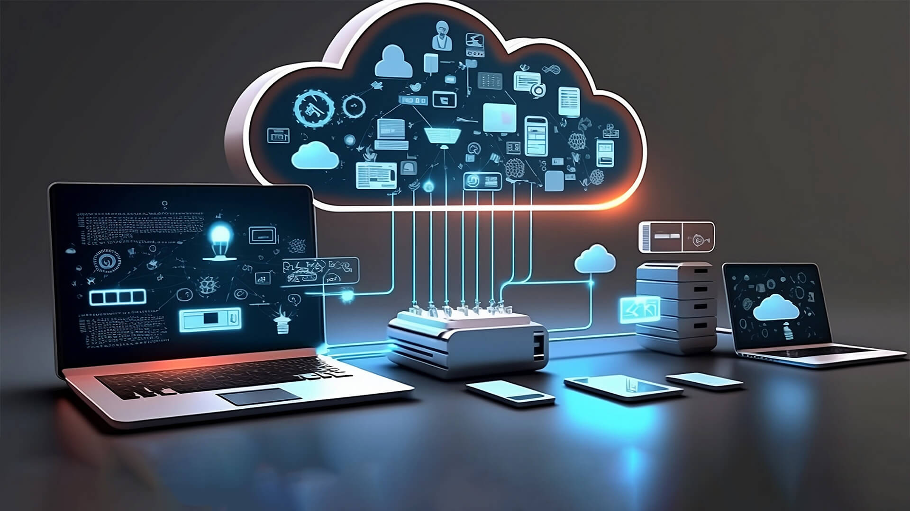
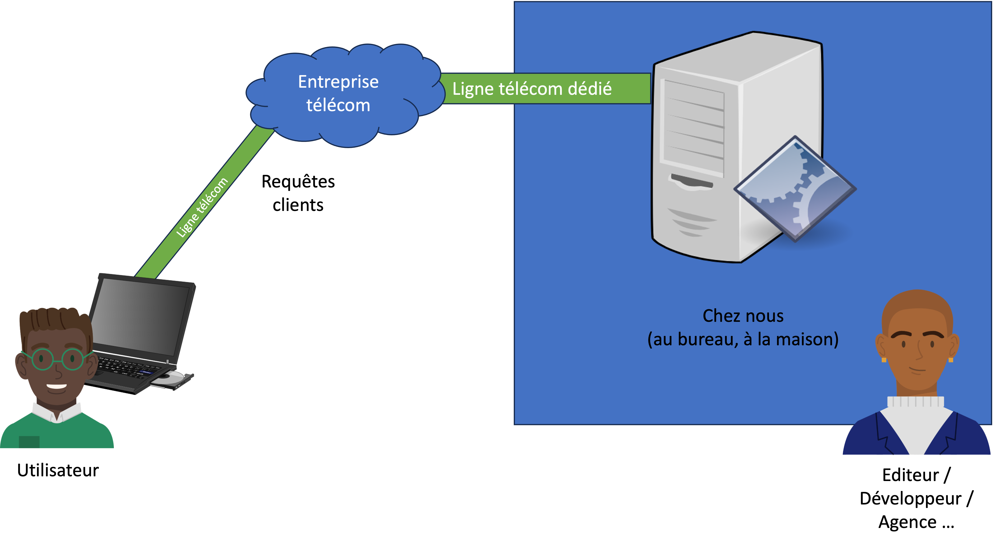
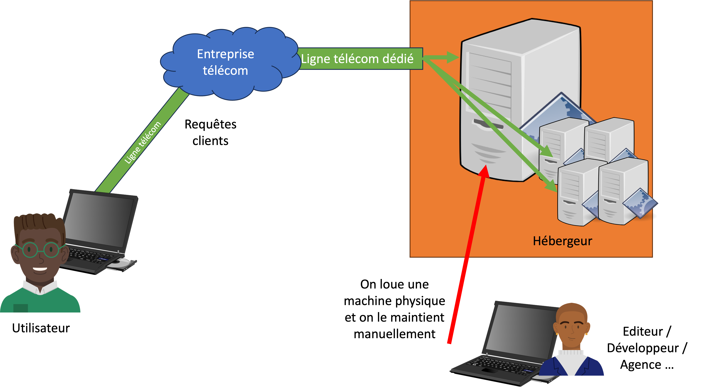
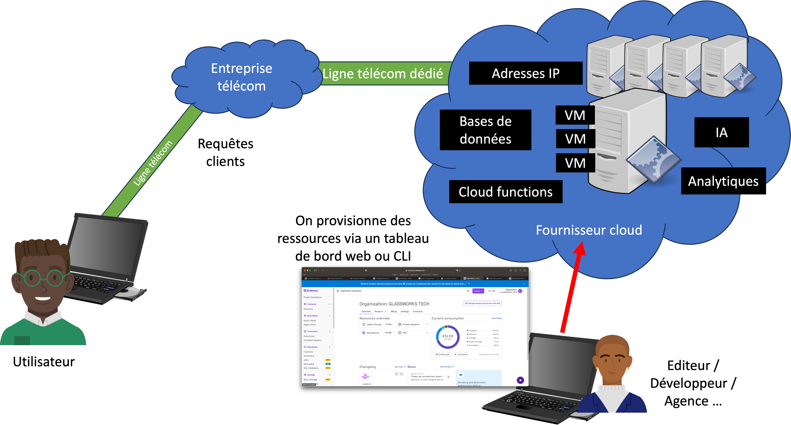

# Pourquoi cloud ?

Qu'est-ce que le cloud ?

L'informatique en nuage, en termes généraux, désigne la mise à disposition de ressources informatiques sur Internet.

<figure><figcaption></figcaption></figure>

L'hébergement d'un serveur local, ou même la location d'un serveur auprès d'un fournisseur, peut souvent s'avérer problématique :

* Il requiert un certain niveau d'expertise
* Il faut veiller en permanence à ce que la mémoire, le stockage et les autres ressources soient suffisants.
* Il nécessite une mise à jour et une maintenance manuelles.
* Il est difficile de l'adapter facilement à la demande.

<figure><figcaption>
Configuration initiale au début du web - hébergement sur place
</figcaption></figure>

Dans le modèle présenté dans l'image ci-dessus, il était nécessaire de maintenir les services manuellement. Cela nécessitait beaucoup d'expertise et ne résistait pas aux fluctuations de la demande. Il était également assez compliqué et coûteux de fournir l'infrastructure physique (location d'une ligne téléphonique spécialisée, achat d'un équipement serveur onéreux).

<figure><figcaption>
Hébergement à distance
</figcaption></figure>

C'est pourquoi le modèle a rapidement évolué vers l'hébergement à distance. Les entreprises fournissent l'infrastructure physique, notamment un serveur, et le réseau associé. Cette solution éliminait la partie complexe de l'hébergement d'un service en ligne - plus de réseau compliqué ni de machines physiques à entretenir. Mais il fallait encore configurer et entretenir le logiciel sur la machine louée. En outre, ce modèle n'était pas facilement extensible - pour s'adapter à l'évolution de la demande, il fallait prévoir à l'avance le nombre de serveurs à louer.

En outre, l'installation, la configuration et la maintenance de logiciels et de services complexes (bases de données, caches, etc.) devaient encore être effectuées manuellement.

Le Cloud a évolué au fil des années pour résoudre ces problèmes.

<figure><figcaption>
Services cloud
</figcaption></figure>

Dans le Cloud, d'une manière générale, l'architecture physique, la mise en réseau et parfois même l'installation de logiciels spécifiques ne sont pas prises en compte par le client.

Les fournisseurs cloud s'occupent de tous ces aspects, tout en **abstrayant** les fonctionnalités en un certain nombre de **services** que nous contrôlons à l'aide de **panneaux de contrôle** basés sur le web ou d'interfaces en **ligne de commande**.

Nous interagissons jamais avec des machines ou des architectures physiques.

Les fournisseurs cloud peuvent donc fournir les ressources physiques nécessaires à la demande et les adapter automatiquement si nécessaire. En outre, le fournisseur cloud nuage peut **gérer de manière transparente les défaillances du matériel** physique, la duplication des services, **les attaques malveillantes** et bien d'autres choses encore, sans que l'utilisateur s'en rende compte.

## Caractéristiques

Les fournisseurs de services Cloud se distinguent souvent par les caractéristiques suivantes :

* **partage des ressources** : le matériel coûteux peut être partagé par plusieurs clients, ce qui permet de réduire les coûts
* **ressources à la demande** : il est facile et rapide de fournir des ressources telles que des machines virtuelles, de l'espace de stockage, des adresses IP, etc. Généralement à l'aide d'un panneau de contrôle dédié ou d'une interface de ligne de commande.
* **facturation à l'utilisation** : seules les ressources utilisées sont facturées sur une période donnée. Cela permet d'optimiser les coûts.
* **surveillance et mise à l'échelle** : de nombreux fournisseurs surveillent automatiquement l'utilisation et la demande, ajoutent ou suppriment automatiquement des ressources et envoient des alertes en cas d'utilisation ou de facturation élevées.
* **niveaux de service** : les infrastructures sont surveillées pour détecter les pannes ou les attaques (par exemple, DDoS) et le fournisseur les traite dans le cadre de son service.
