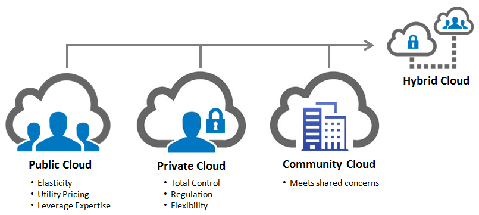

# Types de services cloud

Il existe aujourd'hui sur le marché un certain nombre de modèles qui dépendent des besoins et de l'utilisation du client.

Nous voyons souvent l'expression "X en tant que service" qui se réfère généralement à un modèle de nuage.

<figure><figcaption>
<a href="https://www.lucidchart.com/blog/fr/comprendre-les-principes-du-cloud-computing">Source</a>
</figcaption></figure>

## Infrastructure as a Service (IaaS)

Ne prévoir que des éléments architecturaux, y compris :

* les machines virtuelles
* les réseaux virtuels privés et publics
* les équilibreurs de charge (load-balancers)
* les adresses IP
* le stockage

Presque tous les fournisseurs d'informatique en nuage les plus connus aujourd'hui proposent ces services (AWS, GC, OVH, ...). Ils constituent l'épine dorsale de l'informatique en nuage moderne. Cependant, ils sont les plus difficiles à configurer et requièrent une certaine expertise.

## Function as a Service (FaaS)

De nombreux fournisseurs permettent aujourd'hui à un développeur d'écrire un code personnalisé et de le déployer dans une infrastructure déjà mise en place pour exécuter ce code.

Par exemple, un développeur peut écrire une fonction Javascript/NodeJS et la déployer dans le nuage pour l'exécuter.

Le fournisseur de services en nuage fournira l'unité centrale, la mémoire vive, le réseau, etc. nécessaires, ainsi que le système d'exploitation et l'interpréteur adéquats pour exécuter la fonction.

La fonction peut être invoquée à la suite d'une requête web HTTP, ou par d'autres déclencheurs tels que des délais d'attente ou des événements qui se produisent dans d'autres services (tels que l'écriture dans une base de données).

Examples :

* Heroku
* Firebase functions
* Cloud functions chez Scaleway, GC, Azure, AWS

## Platform as a Service (PaaS)

Au lieu de demander une machine virtuelle et un réseau particuliers, cette couche architecturale peut être davantage abstraite. Par exemple, un client peut être intéressé par la configuration d'une base de données SQL. Celle-ci peut être fournie en tant que PaaS : le fournisseur se chargera automatiquement de fournir les ressources physiques et de réseau adéquates (souvent en les mutualisant entre plusieurs clients), d'installer le logiciel et d'accorder l'accès au client.

Aujourd'hui, de nombreux fournisseurs proposent des produits en tant que service :

* Serveurs de mailing
* Bases de données SQL (MySQL, PostGres)
* Bases de données NoSQL (MongoDB Atlas)
* Sites web WordPress
* Frameworks MVC (Symfony, Ruby on Rails, ASP.NET Core, ...)
* Dépôts GIT (GitLab)
* ...

## Software as a Service (SaaS)

Enfin, de nombreuses entreprises profitent aujourd'hui de ces infrastructures pour fournir une plateforme entièrement fonctionnelle à leurs utilisateurs, connue sous le nom de SaaS. Un SaaS se définit par les caractéristiques suivantes :

* Généralement accessible en ligne uniquement via le navigateur web.
* Aucune installation locale n'est requise
* Abstraction totale de tout aspect physique
* Sauvegardes, niveaux de service (SLA), sécurité des données

Exemples :

* Salesforce
* Mailjet
* Google Drive
* ChatGPT
* ...

## Public / Private / Hybrid

<figure><figcaption>
[Source](https://solutions.trustradius.com/buyer-blog/paas-deployment-model-options/)
</figcaption></figure>

Le plus souvent, nous utilisons des services cloud publics où toutes les ressources sont mutuellement partagées (GCP, AWS, Azure, etc.): **public cloud**

Toutefois, lorsqu'il s'agit d'informations sensibles, certains fournisseurs proposent des services privés. Les ressources peuvent être physiquement situées dans un data-center du fournisseur ou sur le site de l'entreprise. Dans tous les cas, les ressources sont privées et ne sont pas partagées avec d'autres client: **private cloud**.

Il existe également des modèles hybrides dans lesquels les services non sensibles sont hébergés dans le nuage public et connectés à des nuages privés pour le traitement des données sensibles : **hybrid cloud**
