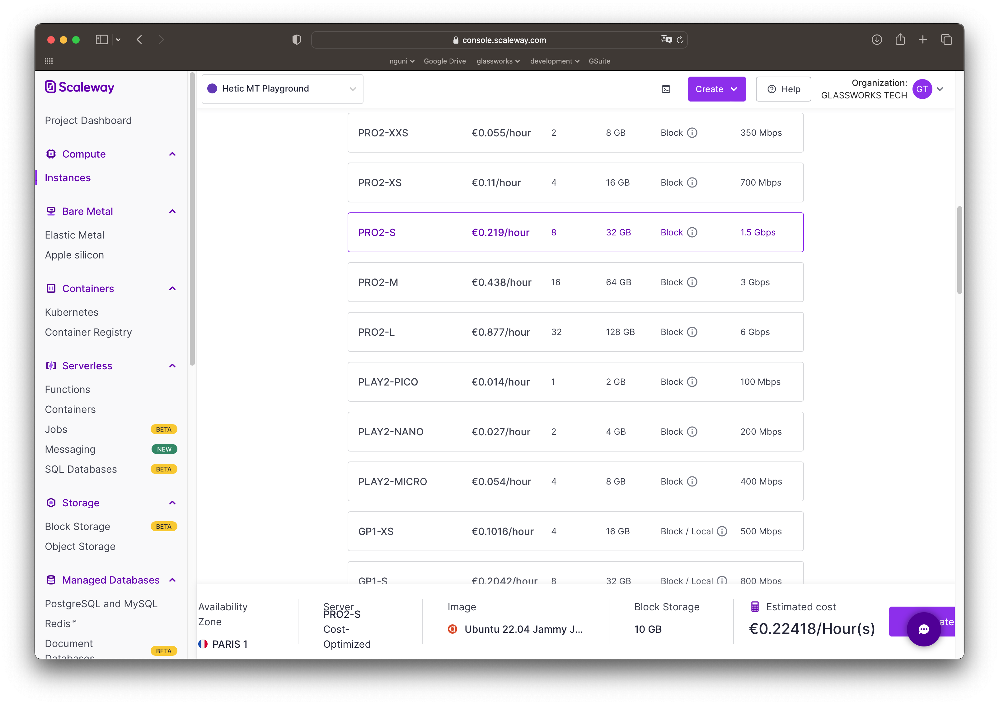
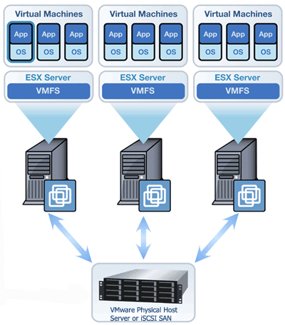

# Machines virtuelles

La **machine virtuelle** est un élément fondamental de tout fournisseur de services Cloud.

Il s'agit des ressources de calcul et de traitement que nous pouvons mettre à disposition.

En règle générale, vous faites les choix suivants chez votre fournisseur :

* Choix du data-center : où votre machine virtuelle doit-elle se trouver exactement ?
* Choix de l'architecture : X86-64, ARM, M1, M2, etc.
* Choix de la puissance de traitement, exprimée en nombre de **vCores**
* Choix de la RAM
* Bande passante

<figure><figcaption>
Scaleway "Instances"
</figcaption></figure>

Une machine virtuelle est techniquement un système d'exploitation qui fonctionne **à l'intérieur** d'un autre. Un ordinateur doté de la _virtualisation_ peut effectivement partager les ressources matérielles de la machine et exécuter plusieurs systèmes d'exploitation à la fois.

Vous pouvez, par exemple, créer vos propres machines virtuelles sur vos propres ordinateurs en utilisant VirtualBox (https://www.virtualbox.org/), VMWare (https://www.vmware.com/) ou UTM (https://mac.getutm.app/).

Chez notre fournisseur de cloud, nous pouvons donc louer une machine virtuelle sur son infrastructure physique. Techniquement, il s'agit de démarrer un système d'exploitation sur une machine physique qui héberge un certain nombre d'autres machines virtuelles (appelé **hyperviseur**).

<figure><figcaption>
[Source](https://www.icssnj.com/VMWare-installation-support.html)
</figcaption></figure>

Nous ne nous soucions pas de savoir quel hyperviseur fait tourner notre VM, et notre fournisseur peut, par exemple, déplacer notre VM d'une machine physique à une autre sans que nous en soyons informés. Pourquoi ils le feront ?

## Système d'exploitation

Au cours de la phase de provisionnement, nous choisissons généralement le système d'exploitation à installer dans la VM. Les choix les plus populaires sont Linux, mais Windows et parfois MacOS sont également possibles.

Une fois la machine provisionnée, nous pouvons nous y connecter à distance en utilisant SSH (si Linux ou MacOS).

## Autres ressources

Un ordinateur physique nécessite plus qu'un simple processeur et de la mémoire vive pour fonctionner.

Nous avons notamment besoin d'espace disque pour installer notre système d'exploitation et nos logiciels.

Lorsque nous déployons une VM, le fournisseur provisionne et attache les **volumes** qui fournissent cet espace de stockage.

Notre VM doit être connectée à l'internet pour que nous puissions nous y connecter et l'utiliser. Notre fournisseur fournira donc l'infrastructure de réseau appropriée. Plus particulièrement, il fournira une **adresse IP** ou un **nom de domaine pleinement qualifié** (FQDN) que nous pourrons utiliser pour nous connecter à notre machine via SSH.

## Vocabulaire

| Fournisseur | Terme               |
| ----------- | ------------------- |
| AWS         | EC2                 |
| Azure       | Machine Virtuelle   |
| GCP         | Compute Engine / VM |
| OVH         | Compute - Instances |
| Scaleway    | Compute - Instances |

## L'option "Bare Metal"

Parfois, nous ne souhaitons pas partager les ressources avec d'autres clients et nous avons besoin de ressources dédiées à 100 %.

Dans ce cas, nous pouvons revenir à l'ancien modèle de location d'un dispositif physique dans le centre de données.

Il s'agit généralement d'un dispositif _Bare-Metal_, ce qui signifie qu'il n'y a pas de virtualisation ou de partage.

Avantages :

* amélioration des performances
* exclusivité

Inconvénients :

* coûteux
* nécessite une surveillance et une maintenance manuelles
