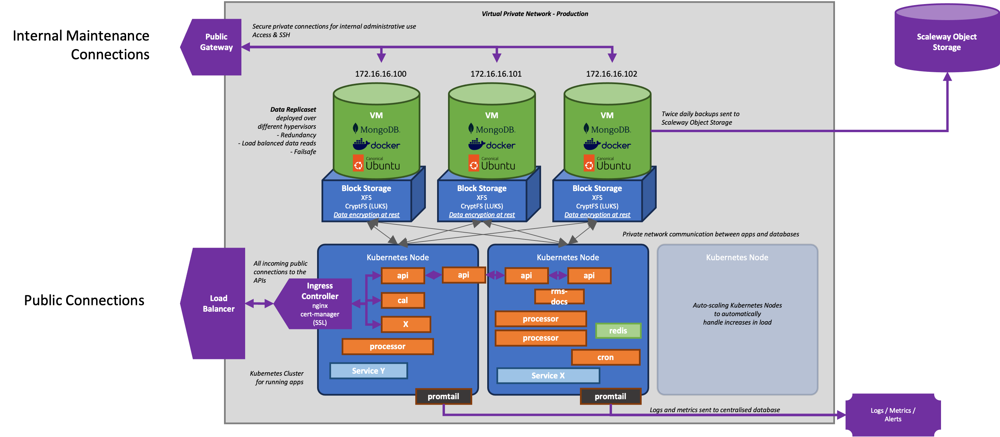

# Réseau

La plupart des fournisseurs prennent en charge le réseau nécessaire pour accéder à nos machines virtuelles.

En règle générale, chaque machine virtuelle se voit attribuer une adresse IP publique. Cette adresse est considérée comme une ressource facturée. Cette adresse est ensuite utilisée par nous (pour installer et maintenir la VM) et par nos clients (qui consomment nos services hébergés sur la VM, par exemple des sites web).

Toutefois, la plupart des fournisseurs IaaS proposent également des options plus complètes : 

* **Réseaux privés (VPN)** : cela nous permet de compartimenter nos ressources. Certaines existeront sur un réseau privé qui n'est pas accessible depuis l'Internet extérieur. Typiquement, il s'agit de connecter des VM qui effectuent des travaux tels que le stockage interne de données (bases de données), le traitement de données (IA), la mise en cache, etc. Chaque VM interne aura une adresse IP privée (10.0.0.* ou 192.168.1.*) qui n'est pas accessible de l'extérieur.
* **Load Balancer** : il s'agit d'une ressource publique qui accepte les connexions du monde extérieur et les redirige vers les ressources internes. Il répartit généralement la charge en redirigeant une demande vers la ressource la moins occupée, et joue un rôle crucial dans la mise à l'échelle horizontale. Les répartiteurs de charge ont une adresse IP publique ou un FQDN. En option, les équilibreurs de charge peuvent s'occuper de la sécurité, par exemple en appliquant le cryptage SSL.
* **Gateways** : ils fournissent un accès à notre réseau privé interne, généralement pour un accès interne, comme la maintenance d'une base de données qui n'est pas orientée vers le public. Elles appliquent un niveau de sécurité élevé (SSH) et fournissent un tunnel crypté vers les ressources internes.

## Exemple

<figure><figcaption>
Exemple d'architecture IaaS
</figcaption></figure>