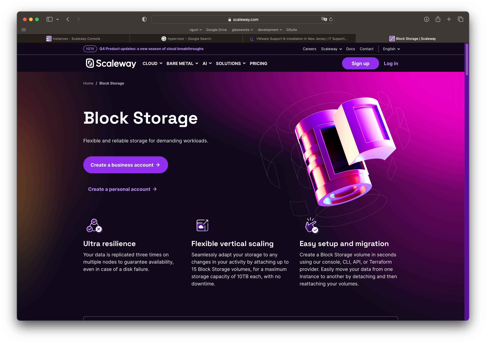

# Volumes

Les volumes font référence à l'espace de stockage que nous pouvons attacher à nos machines virtuelles, ou provisionner pour le stockage de données associées à d'autres services.

Techniquement parlant, nous réservons une partie de l'espace sur un disque plus grand qui est partagé par d'autres clients.

Lorsque vous provisionnez un volume, un certain nombre de questions vous sont posées :

- L'emplacement du volume / région : où stocker les données physiquement. Il y aura peut-être des contraintes légales à respecter (ex. RGPD)
- La taille du volume 
- Le type de stockage (SSD, SATA)

La plupart des fournisseurs de cloud computing mettent aujourd'hui en œuvre ces volumes de stockage en utilisant des techniques de pointe pour le stockage de données redondantes et tolérantes aux pannes (par exemple RAID).

<figure><figcaption>
Offre Scaleway "Block Storage"
</figcaption></figure>

## Vocabulaire

| Fournisseur | Terme |
|--|--|
| AWS | EFS ou S3 |
| Azure | Compte de stockage |
| GCP | Cloud Storage / Disks |
| OVH | Object Storage / Block Storage |
| Scaleway | Volumes / Object Storage / Block Storage |