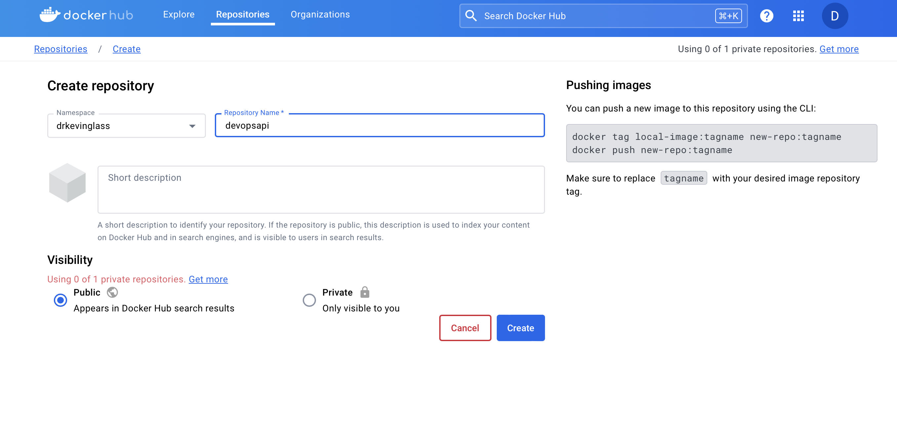

# Créer une image

Nous allons maintenant construire une image Docker à partir de notre code source.

Nous allons le faire *en dehors* de notre DevContainer :

- si vous êtes sous Windows, ouvrez un nouveau PowerShell
- si vous êtes sous MacOS ou Linux, ouvrez un nouveau Terminal

Naviguez dans le dossier du projet.

## Instructions

Jetez un coup d'œil au fichier `./docker/Dockerfile.prod` :


```Dockerfile
FROM node:18-alpine AS api-builder
WORKDIR app
COPY . .
RUN npm install
RUN npm run clean
RUN npm run build

FROM node:18-alpine AS api
WORKDIR app
COPY --from=api-builder /app/build ./
COPY package* ./
RUN npm install --omit=dev
CMD npm run start-api
```

Voici la recette pour construire une image docker avec notre projet.

La construction se déroule en deux phases. Dans la première phase, nous *construisons* le projet :

1. Télécharger une image existante node:18-alpine
2. Copier tous les fichiers du répertoire courant dans l'image
3. Installer toutes les dépendances
4. Lancer un build (transpiler le typecript en javascript)

Dans la deuxième phase, nous construisons une image propre avec seulement le strict minimum requis pour faire fonctionner notre API. Nous ne copions que le résultat de la compilation (javascript transpilé) mais pas les sources du script de type, par exemple.

## Build

Pour construire l'image, nous exécutons la commande suivante :

```sh
docker buildx build --platform linux/amd64  -t devops_api_prod -f ./docker/Dockerfile.prod .
```

L'image est construite, et on peut le voir avec la commande :

```sh
docker image ls | grep "devops_api_prod"  
```

## Dépôt externe : Docker Hub

Nous allons maintenant télécharger cette image dans le dépôt Docker Hub, où notre serveur, ou notre infrastructure, pourra la télécharger et démarrer le conteneur.

[Docker Hub](https://hub.docker.com)

Créez un nouveau compte (gratuit).

Créez un nouveau "Repository", en le donnant le nom `devopsapi` :




## Tag

Nous voulons maintenant télécharger notre image sur Docker Hub.

Nous devons d'abord changer son nom (autrement dit sa balise) pour qu'elle fasse référence à Docker Hub :


```sh
docker tag devops_api_prod  [VOTRE NOM D'UTILISATEUR DOCKER HUB]/devopsapi:1.0.0
```

## Connexion

Nous devons nous connecter à Docker Hub afin de pousser notre image.

Dans Docker Hub (navigateur), cliquez sur votre profil (en haut à droite), le menu " Profil ", puis " Sécurité ".

Ajouter un nouveau "Access Token". Copiez le jeton d'accès généré, vous ne le verrez qu'une seule fois !

Ensuite, de retour dans votre terminal, exécutez :

```sh
docker login -u [VOTRE NOM D'UTILISATEUR DOCKER HUB]
```

À la demande de mot de passe, collez votre jeton d'accès.


## Push

Vous êtes maintenant connecté à Docker Hub. Vous pouvez télécharger votre nouvelle image en utilisant :

```
docker push [VOTRE NOM D'UTILISATEUR DOCKER HUB]/devopsapi:1.0.0
```

Votre image est maintenant disponible sur Docker Hub ! 

Allez jeter un coup d'oeil dans le navigateur !

## Tester

Testons notre image ! D'abord arrêtez votre serveur dans votre DevContainer.

```sh
# Enlever la version locale, pour forcer la version de Docker Hub
docker image rm [VOTRE NOM D'UTILISATEUR DOCKER HUB]/devopsapi:1.0.0

# Lancer l'image de Docker Hub
docker run -p 5151:5050 [VOTRE NOM D'UTILISATEUR DOCKER HUB]/devopsapi:1.0.0
```

Vous verrez :

```
Unable to find image 'drkevinglass/devopsapi:1.0.0' locally
1.0.0: Pulling from drkevinglass/devopsapi
Digest: sha256:51993446c5fe441232e2673df6e26eb71ad2833297642a9f38b9da0803b20657
Status: Downloaded newer image for drkevinglass/devopsapi:1.0.0

> server@1.0.0 start-api
> node ./server.js

info: API Listening on port 5050 {"tag":"exec"}
```

Vous pouvez maintenant tester votre API qui tourne dans votre image déployée !

```sh
curl http://127.0.0.1:5151/info

# Resultat :
{"title":"DevOps Code Samples API","host":"4c320d7f5a06","platform":"linux","type":"Linux"}
```

D'accord, mais comment déployer cela dans notre infrastructure ?