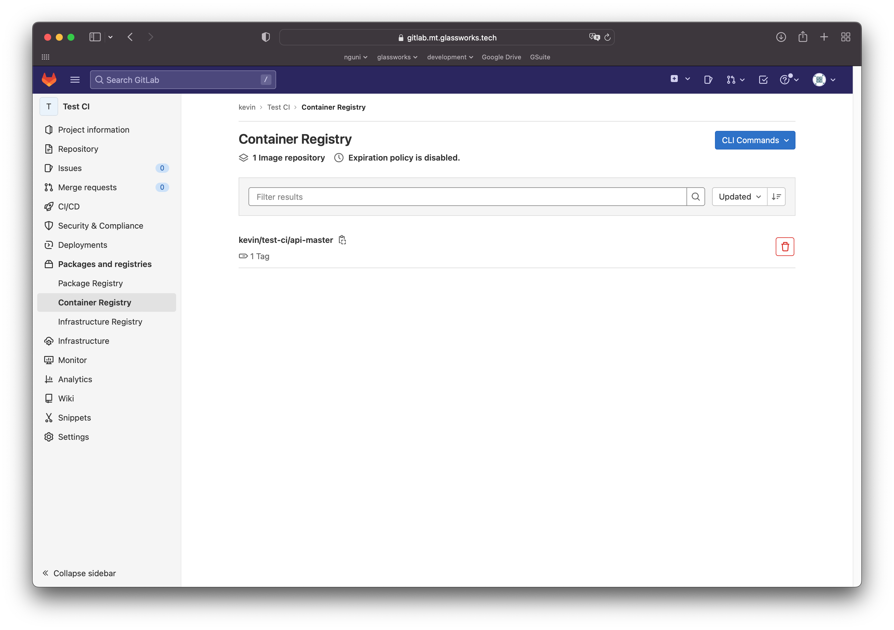

# Continuous integration

Maintenant qu'on a une banque de tests automatiques, on aimerait les utiliser pour assurer notre procédure de Continuous Integration.

Pour cela, il faudrait une plateforme de développement comme GitHub ou GitLab, qui va permettre l'automatisation des tâches.

Pour ce cours, nous allons utiliser une instance de Gitlab que je mets à votre disposition :

[https://gitlab.mt.glassworks.tech](https://gitlab.mt.glassworks.tech)

Vous pouvez vous créer un compte avec votre **adresse autre que `@hetic.eu`** (qui bloque les emails du serveur GitLab). 

**Merci d'utiliser votre vrai nom pour la création du compte pour que je puisse vous identifier plus facilement.**

N'oubliez pas de charger votre clé SSH pour plus simplement faire les clones et pull et push.

## Créer votre projet Gitlab

Connectez-vous au serveur Gitlab, créez votre premier projet :

- Le projet devrait être en mode `Private`. 
- Laissez activé l'option de créer une `README.md`

Après avoir crée le projet, sur la page principale du projet, cliquez sur le bouton bleue "Code", et copiez le lien "https://...". Collez ce lien dans un fichier brouillon. Nous allons l'utiliser plus tard !

### Créer un jeton d'accès

Sur Gitlab, naviguez dans "Settings -> Access Tokens". Ajoutez un nouveau token avec les droits suivante :

- Role: "Maintainer"
- `read_repository`
- `write_repository`

Copiez le jeton généré. Attention, il n'est affiché qu'une seule fois ! Collez le jeton dans votre fichier brouillon. On va l'utiliser plus tard !

### Configurer GIT dans votre DevContainer

Retournez à votre projet VSCode.

Dans le terminal tapez, en remplaçant les coordonnées :

```sh
# Etablir notre identité
git config --global user.name "Your Name"
git config --global user.email "your.email@address"

# Préciser comment se souvenir de nos coordonnées de connexion
git config --global credential.helper "store --file $HOME/.git-credentials"
```

Ceci établit votre identité pour toues les interactions avec GIT.

### Préparer votre projet

Créez et sauvegardez votre projet :

```sh
git init -b main 

# Préciser qu'on va toujour fusionner nos modifications
git config pull.rebase false    

git add .
git commit -m "Ajouter la première version de mon code à GIT"
```

Une fois seulement, nous allons dire à GIT où synchroniser notre projet :
```sh
# Remplacez LE_LIEN_COPIÉ_DE_VOTRE_PROJET_GIT par votre lien https://gitlab.mt....
git remote add origin LE_LIEN_COPIÉ_DE_VOTRE_PROJET_GIT

# Récupérer la toute première version de notre projet de GIT
# Remplacez LE_LIEN_COPIÉ_DE_VOTRE_PROJET_GIT par votre lien https://gitlab.mt....
GIT_MERGE_AUTOEDIT=no git pull LE_LIEN_COPIÉ_DE_VOTRE_PROJET_GIT main --allow-unrelated-histories

# VSCode va afficher une interface en haut de l'écran demandant vos coordonnées de connexion :
# - précisez votre nom d'utilisateur gitlab quand demandé
# - coller votre token privé que vous avez généré dans Settings -> Access Tokens

# Il est possible qu'il y a un CONFLIT entre la version locale et la version récupérée du serveur
# Si c'est le cas, la commande précédente indiquera `CONFLIT` et affichera le fichier
# Ouvrez ce fichier et résolvez le conflit !

# Ajoutez des fichiers modifiés
git add .

# Puisque les 2 projets sont différents, nous allons sauvegarder les différences
git commit -m "Merge avec la version de gitlab"

# Envoyer notre version vers le serveur
git push --set-upstream origin main
```


Si vous vous êtes trompés de `origin` ou vous avez des erreurs concernant l'`origin`, on peut recommencer en faisant :

```bash
git remote delete origin
```



### Modifications futures

Quand vous apportez des modifications à votre base de code, vous pouvez désormais faire le suivant :

```sh
git add .
git commit -m "Le message qui décrit vos modifications"
git push
```

Si jamais une version plus récente existe sur le serveur, il faut d'abord faire :

```bash
git pull
```

... afin de récupérer cette version du serveur, avant de faire `git push`

Dans le cas où, en récupérant une version du serveur, git rencontre une erreur style "vous avez de modifications locales", il y a deux options :

```bash
# SOIT : enlever les modifications locales
git stash

# SOIT : créer une version à partir des modifications locales
git add .
git commit -m "un message"
```


## Gitlab Runner

Le processus de CI qu'on est en train de créer s'appelle autrement "Automated DevOps". Nous allons lancer les processus qui s'occupe automatiquement du build et test de notre base de code.

Pour ce faire, il faudrait lui donner des ressources d'exécution (CPU, RAM, stockage, etc).

On appelle une ressource d'exécution un **Runner** dans GitLab.

Qu'est-ce que c'est un Runner ?

<figure><figcaption></figcaption></figure>

Un **Runner** est un processus qui tourne sur un autre serveur ou instance.

Je vous ai déjà créé de Runners sur mon instance qui sont partagés sur touts la classe. Vous pouvez le voir en naviguant dans les réglages de votre projet sur Gitlab (Settings / CICD / Runners):

<figure><figcaption></figcaption></figure>

## .gitlab-ci.yml

Gitlab va automatiquement lancer des processus d'intégration et/ou déploiement selon les instructions précisées dans le fichier `.gitlab-ci.yml` qui devrait se trouver à la racine de notre projet.

Alternativement, on pourrait naviguer dans le menu CI/CD de Gitlab, et dans le sous-menu **Build &rarr; Pipeline Editor**, pourrait modifier directement ce fichier.

<figure><figcaption></figcaption></figure>

> Notez qu'avec chaque sauvegarde, on fait implicitement un **commit** à notre branche actuelle !

Collons le texte suivant dans l'éditeur :

```yml
# "stages" décrit les différentes étapes de notre déroulé (pipeline)
stages:  
  - test

unit-testing-job:      
  stage: test        # chaque tâche doit préciser le "stage" dans lequel il se trouve
  image: node:20     # l'image docker à utiliser pour exécuter notre code
  tags:              # le tag du "runner" à utiliser (nous avons précisé "general")
    - general
  only:              # précise les conditions d'exécution de cette tâche
    - master         
    - main
    - merge_requests
    - production
  artifacts:         # quels sont les fichiers sortant de cette tâche
    reports:
      coverage_report:
        coverage_format: cobertura
        path: coverage/unit/cobertura-coverage.xml
  coverage: '/Statements\s*: \d+\.\d+/'
  script:           # les instructions à exécuter dans le conteneur Docker
    - echo "Compiling the code..."
    - npm install
    - echo "Running unit tests..."
    - npm run unit    
    - echo "Complete."

```

Quand on sauvegarde, Gitlab va lancer un "Runner" (avec le tag `general`).

Quand le pipeline de Gitlab se lance, un Runner est activé pour chaque tâche. En vrai, un container Docker est créé, dans lequel tourne le script précisé sous `script` dans `.gitlab-ci.yml`.

<figure><figcaption></figcaption></figure>

## Stages

Notre pipeline se compose de plusieurs étapes. Chaque étape doit compléter avant de procéder au suivant. Dans notre fichier, on a créé une seule étape `test`. On a attaché la tâche `unit-testing-job` à cette étape.

## Le tag `only`

Via le tag `only`, on a pu préciser exactement QUAND chaque tâche doit être exécutée. Ici, on précise que le pipeline doit exécuter s'il y a un **commit** sur la branche `master`, `main` ou `production`. Aussi, si un **merge-request** est créé ou mis à jour.

Cela veut dire que si on crée une branche lambda, le pipeline ne va s'exécuter tant que cette branche ne devient pas un **merge-request**.

## Artéfacts

Un artéfact est un fichier sortant de notre tâche qui sera sauvegardé dans Git. Ici, on utilise les données sortantes de `istanbul` qui indique le _code coverage_ de nos tests. Gitlab comprend ce format, et on pourrait donc voir dans les **merge-requests** les lignes touchées par les tests ou pas.

Testons en créant une branche, en effectuant une modification, et en créant un **merge request** :

```bash
git branch test-code-coverage
git checkout test-code-coverage
# Ajouetr une modification dans le code

git add .
git status
git commit -m "Added a log"
git push --set-upstream origin test-code-coverage
```

Naviguer dans Gitlab. Vous verrez la branche sous Repository / Branches, et on peut créer un **merge request**.

Après avoir créé le **merge-request**, on voit que le **pipeline** a été créé. On attend qu'il soit terminé.

<figure><figcaption></figcaption></figure>

Une fois terminé, on aura un rapport sur la couverture de nos tests !

Si on regarde les modifications apportés par le **merge request**, on verra des petits traits verts qui indiquent si les tests ont bien couvert une ligne précise ou pas :

<figure><figcaption></figcaption></figure>

## Surveiller l'exécution

On peut voir l'avancement de notre pipeline :

<figure><figcaption></figcaption></figure>

Et, pour chaque tâche, consulter le progrès ou les résultats :

<figure><figcaption></figcaption></figure>

Partout dans Gitlab, on peut aussi consulter le statut du pipeline :

<figure><figcaption></figcaption></figure>


Exercice : Est-ce que votre pipeline termine correctement ? Essayer de modifier vos codes sources pour ne plus faire fonctionner vos tests, et faire un commit. Qu'est-ce qui se passe ?

N'oubliez pas de corriger votre code après !


## Ajouter une étape pour nos tests d'intégration

On va ajouter nos tests d'intégration.

Par contre, ses tests ont besoin d'une dépendance externe, notamment MariaDB. Comment faire ?

Grâce à Docker, on pourrait préciser MariaDB comme un service externe.

Ajoutez le suivant à votre `.gitlab-ci.yml` :

```yml
integration-testing-job:      
  stage: test       # Cette tâche va tourner dans l'étape test, en parallèle de l'autre test
  image: node:20
  tags:
    - general
  only:
    - master     
    - main
    - merge_requests
    - production
  services:        # On peut préciser les services externes, comme dans un docker-compose.yml
    - name: mariadb:10
      alias: test-dbms      
      command: [
        "--character-set-server=utf8mb4",
        "--collation-server=utf8mb4_unicode_ci"
      ]
      variables:  # Les variables pour initialiser MariaDB (normalement les contenus du .env)
        MYSQL_ALLOW_EMPTY_PASSWORD: "false"
        MYSQL_ROOT_PASSWORD: "rootpassword"
        MYSQL_DATABASE: "school_test"     
  variables:      # Les variables d'environnement pour nos tests
    DB_HOST: "test-dbms"                    # Le nom d'hôte est le alias du service ci-dessus
    DB_DATABASE: "school_test"               # Le même nom que dans MYSQL_DATABASE
    DB_ROOT_USER: "root"
    DB_ROOT_PASSWORD: "rootpassword"        # La même valeur que dans MYSQL_ROOT_PASSWORD
    DB_USER: "api-test"                     # La même valeur qu'on utilise dans dbms/ddl/init-test.sql
    DB_PASSWORD: "testpassword"             # La même valeur qu'on utilise dans dbms/ddl/init-test.sql
  artifacts:
    reports:
      coverage_report:
        coverage_format: cobertura
        path: coverage/integration/cobertura-coverage.xml
  coverage: '/Statements\s*: \d+\.\d+/'
  script:
    - echo "Compiling the code..."
    - npm install
    - echo "Running integrations test..."
    - npm run integration-no-env            # Notez qu'on tourne la version *-no-env, puisqu'on fournit le variables ci-dessus
    - echo "Complete."
```

Quand on **push** notre modification, on voit qu'il y a 2 tâches dans notre pipeline maintenant :

<figure><figcaption></figcaption></figure>

Ouvrez la console de la tâche `integration-testing-job`. Vous verrez que MariaDB est chargé et utilisé pour exécuter nos tests !

## Build notre image Docker finale

On est content de nos tests pour le moment. On aimerait maintenant construire une image Docker qu'on pourrait utiliser pour déployer en production.

Heureusement, Gitlab-CI pour le faire pour nous !

D'abord, on va ajouter un stage `build` qui va être exécuté seulement si le stage `test` aurait bien terminé.

```yml
stages:  
  - test
  - build
```

Ensuite, on ajoute une nouvelle tâche à notre pipeline :

```yml
build-job:
  stage: build      # seulement dans le "build" stage
  tags:
    - general      
  only:
    - master
    - main
    - merge_requests
    - production
  image: docker:20.10.16      # L'image pour construire est docker (qui aura la commande docker dedans)
  services:                   # On va appeler au Docker Daemon, ce service nous en donne accès
    - name: docker:20.10.16-dind
      alias: docker
  variables:                  # On va créer une image docker utilisant des variables fournis par Gitlab
    IMAGE_TAG: $CI_REGISTRY_IMAGE/api-$CI_COMMIT_REF_NAME:$CI_COMMIT_SHORT_SHA
  script:
    # Se connecter à Gitlab
    - docker login -u $CI_REGISTRY_USER -p $CI_REGISTRY_PASSWORD $CI_REGISTRY
    - echo "Building docker image..."
    # Créer l'image docker
    - docker build --pull -t $IMAGE_TAG -f ./config/docker/Dockerfile.prod .
    # Envoyer l'image docker dans notre Container Registry sur Gitlab
    - docker push $IMAGE_TAG
    - echo "Done."
```

Regardez la partie **script** : vous vous souvenez que nous avons fait tout cela manuellement dans le chapitre K8s ? Nous sommes maintenant occupés à créer un script qui le fera automatiquement ! En plus, pas besoin d'un compte DockerHub, car Gitlab contient aussi son propre dépôt d'images Docker !

Remarquez un nouveau **stage** dans notre pipeline :

<figure><figcaption></figcaption></figure>

Vous allez remarquer dans la console que l'image Docker est construite en utilisant le `Dockerfile.prod` qu'on avait précisé dans le projet. Notamment, on compile le typescript, et on installe les `node_modules` pour production.


Ensuite, la tâche va envoyer l'image finale à notre "Container Registry" personnalisé sur Gitlab, dans **Deploy &rarr; Container Registry** :

<figure><figcaption></figcaption></figure>

Le Container Registry de Gitlab est comme Docker Hub, sauf qu'on peut gérer les images en interne et en privé !

## e2e test avec notre image de production

Vous avez peut-être remarqué qu'on n'a pas encore intégré nos tests e2e. C'est fait exprès !

En fait, notre objectif est de lancer nos tests e2e contre notre image de production, pour être double sûr que l'image Docker fonctionne correctement. Nous sommes vraiment très proches aux conditions de déploiement !

Cette tâche est un peu plus compliquée à configurer :

* Il faut lancer MariaDB comme avant
* Il faut récupérer notre image qu'on vient de créer, et l'instancier en tant que `service` pour notre tâche (et lui dire de communiquer avec le service MariaDB).
* Ensuite, on lance notre test e2e, en lui disant d'envoyer ses requêtes à ce service

On commence par ajouter une autre étape `e2e-test`:

```yml
stages:  
  - test
  - build
  - e2e-test   
```

On va ajouter une variable globale, qui dit à Gitlab de laisser communiquer les services entre eux (pour que notre API puisse parler avec MariaDB) :

```yml
variables: 
  FF_NETWORK_PER_BUILD: "true" 
```

Ensuite, on ajoute une nouvelle tâche :

```yml
e2e-test-job:
  stage: e2e-test
  tags:
    - general
  only:
    - master
    - main
    - merge_requests
    - production
  services:
    # Notre service MariaDB, configuré comme avant
    - name: mariadb:10        
      alias: test-dbms      
      command: [
        "--character-set-server=utf8mb4",
        "--collation-server=utf8mb4_unicode_ci"
      ]
      variables: 
        MYSQL_ALLOW_EMPTY_PASSWORD: "false"
        MYSQL_ROOT_PASSWORD: "rootpassword"
        MYSQL_DATABASE: "school_test"     
    # On récupère l'image de notre API qu'on avait compilé dans l'étape "build", et on le lance comme service
    - name:  $CI_REGISTRY_IMAGE/api-$CI_COMMIT_REF_NAME:$CI_COMMIT_SHORT_SHA
      alias: school-api     # on l'appelle school-api
      # Ici, le variables de connection pour que notre API puisse parler avec MariaDB 
      # Attention à donner les bons accès à l'utilisateur api
      variables:
        DB_HOST: "test-dbms"
        DB_DATABASE: "school_test"
        DB_USER: "api-test"
        DB_PASSWORD: "testpassword"
        # Le port sur lequel l'api va écouter
        PORT: 5150
  # Ici, les variables pour nos tests
  # Notez qu'on a pas besoin du nom d'utilisateur de l'api, seulement le ROOT pour pouvoir vider et recréer la base de test
  variables:
    FF_NETWORK_PER_BUILD: "true"
    DB_HOST: "test-dbms"
    DB_DATABASE: "school_test"
    DB_ROOT_USER: "root"
    DB_ROOT_PASSWORD: "rootpassword"
    API_HOST: "http://school-api:5150"    # Attention le nom d'hôte correspond à l'alias de notre service
  script:
    - npm install  
    - npm run swagger
    - npm run e2e-no-env   
```

On voit encore une tache dans la pipeline :

<figure><figcaption></figcaption></figure>

## La suite

Ça y est, on a configuré un pipeline CI qui permet au tech-lead de valider qu'une branche passe tous les tests possibles.

Maintenant, il pourrait décider plus tranquillement d'inclure la branche dans le `main` ou `master`, ou bien déployer l'image docker généré en production.

## Le `.gitlab-ci.yml` complet

Vous pouvez cloner le projet entier [ici](https://dev.glassworks.tech:18081/courses/cicd/cicd-code-sample/-/tree/040-ci)

```yml
# "stages" décrit les différentes étapes de notre déroulé (pipeline)
stages:  
  - test
  - build
  - e2e-test   

variables: 
  FF_NETWORK_PER_BUILD: "true" 

unit-testing-job:      
  stage: test        # chaque tâche doit préciser le "stage" dans lequel il se trouve
  image: node:20     # l'image docker à utiliser pour exécuter notre code
  tags:              # le tag du "runner" à utiliser (nous avons précisé "general")
    - general
  only:              # précise les conditions d'exécution de cette tâche
    - master         
    - main
    - merge_requests
    - production
  artifacts:         # quels sont les fichiers sortant de cette tâche
    reports:
      coverage_report:
        coverage_format: cobertura
        path: coverage/unit/cobertura-coverage.xml
  coverage: '/Statements\s*: \d+\.\d+/'
  script:           # les instructions à exécuter dans le conteneur Docker
    - echo "Compiling the code..."
    - npm install
    - echo "Running unit tests..."
    - npm run unit    
    - echo "Complete."

integration-testing-job:      
  stage: test       # Cette tâche va tourner dans l'étape test, en parallèle de l'autre test
  image: node:20
  tags:
    - general
  only:
    - master     
    - main
    - merge_requests
    - production
  services:        # On peut préciser les services externes, comme dans un docker-compose.yml
    - name: mariadb:10
      alias: test-dbms      
      command: [
        "--character-set-server=utf8mb4",
        "--collation-server=utf8mb4_unicode_ci"
      ]
      variables:  # Les variables pour initialiser MariaDB (normalement les contenus du .env)
        MYSQL_ALLOW_EMPTY_PASSWORD: "false"
        MYSQL_ROOT_PASSWORD: "rootpassword"
        MYSQL_DATABASE: "school_test"     
  variables:      # Les variables d'environnement pour nos tests
    DB_HOST: "test-dbms"                    # Le nom d'hôte est le alias du service ci-dessus
    DB_DATABASE: "school_test"               # Le même nom que dans MYSQL_DATABASE
    DB_ROOT_USER: "root"
    DB_ROOT_PASSWORD: "rootpassword"        # La même valeur que dans MYSQL_ROOT_PASSWORD
    DB_USER: "api-test"                     # La même valeur qu'on utilise dans dbms/ddl/init-test.sql
    DB_PASSWORD: "testpassword"             # La même valeur qu'on utilise dans dbms/ddl/init-test.sql
  artifacts:
    reports:
      coverage_report:
        coverage_format: cobertura
        path: coverage/integration/cobertura-coverage.xml
  coverage: '/Statements\s*: \d+\.\d+/'
  script:
    - echo "Compiling the code..."
    - npm install
    - echo "Running integrations test..."
    - npm run integration-no-env            # Notez qu'on tourne la version *-no-env, puisqu'on fournit le variables ci-dessus
    - echo "Complete."

build-job:
  stage: build      # seulement dans le "build" stage
  tags:
    - general      
  only:
    - master
    - main
    - merge_requests
    - production
  image: docker:20.10.16      # L'image pour construire est docker (qui aura la commande docker dedans)
  services:                   # On va appeler au Docker Daemon, ce service nous en donne accès
    - name: docker:20.10.16-dind
      alias: docker
  variables:                  # On va créer une image docker utilisant des variables fournis par Gitlab
    IMAGE_TAG: $CI_REGISTRY_IMAGE/api-$CI_COMMIT_REF_NAME:$CI_COMMIT_SHORT_SHA
  script:
    # Se connecter à Gitlab
    - docker login -u $CI_REGISTRY_USER -p $CI_REGISTRY_PASSWORD $CI_REGISTRY
    - echo "Building docker image..."
    # Créer l'image docker
    - docker build --pull -t $IMAGE_TAG -f ./config/docker/Dockerfile.prod .
    # Envoyer l'image docker dans notre Container Registry sur Gitlab
    - docker push $IMAGE_TAG
    - echo "Done."


e2e-test-job:
  stage: e2e-test
  tags:
    - general
  only:
    - master
    - main
    - merge_requests
    - production
  services:
    # Notre service MariaDB, configuré comme avant
    - name: mariadb:10        
      alias: test-dbms      
      command: [
        "--character-set-server=utf8mb4",
        "--collation-server=utf8mb4_unicode_ci"
      ]
      variables: 
        MYSQL_ALLOW_EMPTY_PASSWORD: "false"
        MYSQL_ROOT_PASSWORD: "rootpassword"
        MYSQL_DATABASE: "school_test"     
    # On récupère l'image de notre API qu'on avait compilé dans l'étape "build", et on le lance comme service
    - name:  $CI_REGISTRY_IMAGE/api-$CI_COMMIT_REF_NAME:$CI_COMMIT_SHORT_SHA
      alias: school-api     # on l'appelle school-api
      # Ici, le variables de connection pour que notre API puisse parler avec MariaDB 
      # Attention à donner les bons accès à l'utilisateur api
      variables:
        DB_HOST: "test-dbms"
        DB_DATABASE: "school_test"
        DB_USER: "api-test"
        DB_PASSWORD: "testpassword"
        # Le port sur lequel l'api va écouter
        PORT: 5150
  # Ici, les variables pour nos tests
  # Notez qu'on a pas besoin du nom d'utilisateur de l'api, seulement le ROOT pour pouvoir vider et recréer la base de test
  variables:
    FF_NETWORK_PER_BUILD: "true"
    DB_HOST: "test-dbms"
    DB_DATABASE: "school_test"
    DB_ROOT_USER: "root"
    DB_ROOT_PASSWORD: "rootpassword"
    API_HOST: "http://school-api:5150"    # Attention le nom d'hôte correspond à l'alias de notre service
  script:
    - npm install  
    - npm run compile
    - npm run e2e-no-env  
```

