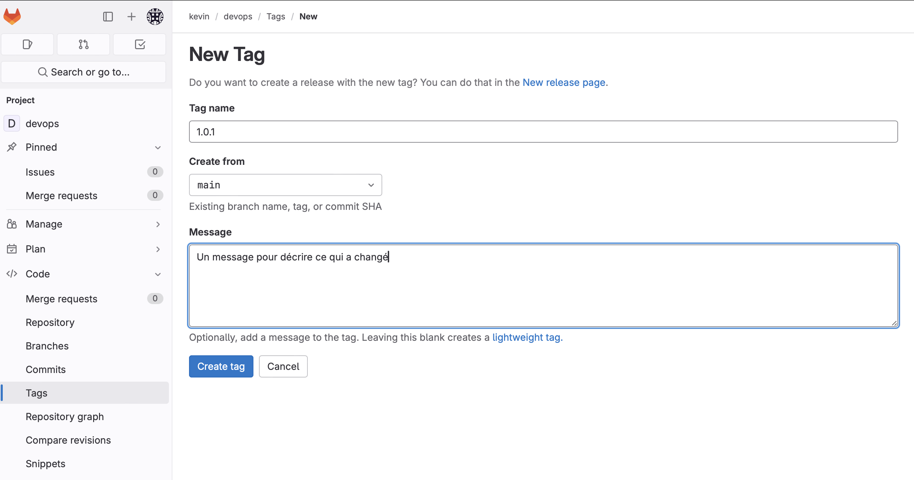
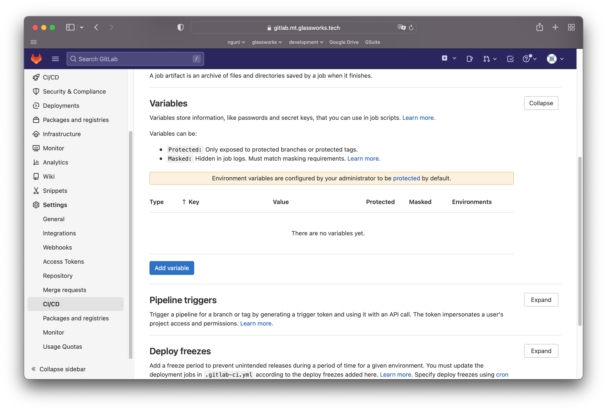
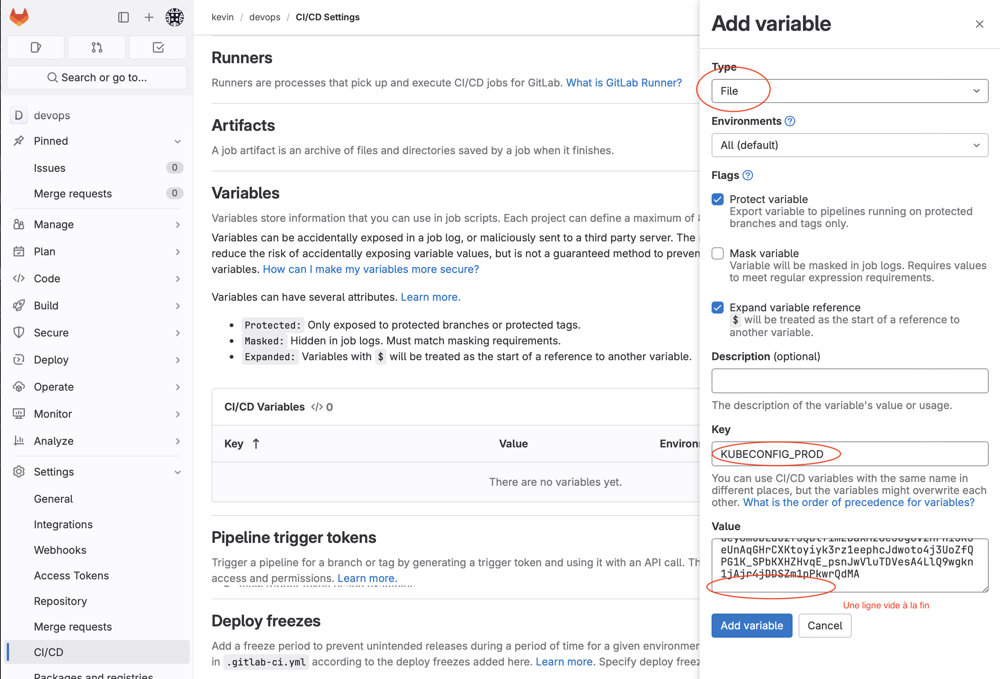

# Continuous deployment

Vous avez probablement remarqué que nous avons automatisé la création d'une image Docker, et qu'elle réside maintenant dans notre registre de conteneurs sur Gitlab.

Maintenant, ce que nous voulons faire, c'est exécuter la bonne commande `kubectl`  pour télécharger cette image dans notre cluster Kubernetes.

Est-ce qu'on peut automatiser ce processus dans notre `.gitlab-ci.yml` ? Oui !


## Publier un image de prod

Nous allons ajouter une étape à notre pipeline: `publish` pour élever notre image déjà créée et testée (avec nos tests e2e) au statut de production, en créant un tag.

D'abord, nous allons **protéger** nos tags dans Gitlab, en précisant que seulement des tags d'un certain format puissent être déployé en production.

Naviguez dans **Settings &rarr; Repository &rarr; Protected Tags**. Tapez `*.*.*` dans la barre de recherche, puis cliquer sur "Create wildcard tag". Sélectionner le role `Maintainers` (seulement les utilisateurs privilégiés auront le droit à déployer); puis cliquer sur "Protect".

Retournez à votre `.gitlab-ci.yaml`, et ajoutez une phase `publish` : 

```yml
stages:  
  - test
  - build
  - e2e-test  
  - publish
```

On ajoute une tâches de plus, qui sera prise en compte _seulement_ si on crée un nouveau **tag** sur notre branch `main`. La première tâche va re-tagger notre image Docker avec la version précisé dans le nom de notre tag.

```yml
publish-job:
  stage: publish
  tags:
    - general
  rules:
    # Only if we create a tag
    - if: $CI_COMMIT_TAG
  image: docker:20.10.16
  services:
    - name: docker:20.10.16-dind
      alias: docker
  variables:
    IMAGE_TAG: $CI_REGISTRY_IMAGE/api-$CI_COMMIT_REF_NAME:$CI_COMMIT_SHORT_SHA
    LATEST_TAG: $CI_REGISTRY_IMAGE/api-prod:$CI_COMMIT_TAG
  script:
    - docker login -u $CI_REGISTRY_USER -p $CI_REGISTRY_PASSWORD $CI_REGISTRY
    # Créer l'image docker
    - docker build --pull -t $IMAGE_TAG -f ./docker/Dockerfile.prod .
    # Retagger l'image avec le tag fourni
    - echo "Retagging docker image..."
    - docker tag $IMAGE_TAG $LATEST_TAG     # Elever notre image au tag "latest"
    - echo "Push image with latest tag..."
    - docker push $LATEST_TAG               # Envoyer l'image à notre Container Repository
    - echo "Done."
```

Ajoutez cette tâche à votre pipeline, et ensuite créez un tag sur votre code dans **Code &rarr; Tags**. Normalement le tag représente la version, par exemple 1.0.1 :




Retournez dans **Build &rarr; Pipelines**, vous verrez le dernier pipeline aura recommencé avec une nouvelle tâche pour publier l'image avec le nom de notre tag. Une fois fini, naviguez dans **Deploy &rarr; Container Registry**. Vous verrez une nouveau dépôt `api-prod` qui contiendra toutes nos images de production.

## Déployer sur k8s

Nous allons ajouter une étape à notre pipeline: `deploy` pour déployer notre image dans le cluster.

```yml
stages:  
  - test
  - build
  - e2e-test  
  - publish
  - deploy
```

La tâche correspondante va connecter à notre cluster, et mettre à jour l'image utilisé par notre déploiement :

```yml
deploy-job:
  stage: deploy
  tags:
    - general
  rules:
    # Only if we create a tag
    - if: $CI_COMMIT_TAG 
      when: manual
  image:
    name: bitnami/kubectl:1.27.5
    entrypoint: ['']
  variables:
    LATEST_TAG: $CI_REGISTRY_IMAGE/api-prod:$CI_COMMIT_TAG
    KUBECONFIG: $KUBECONFIG_PROD
  script:    
    - kubectl set image deployment/devopsapi devopsapi=$LATEST_TAG
```

Prenez note de la phrase `when: manual` - j'ai choisi de faire la tâche manuellement, pour être sur de ne pas se tromper !! 

Pour connecter à notre cluster, il faudrait s'identifier avec notre fichier `kubeconfig`. Il faudrait le fournir à GitLab en tant que secret avec le nom `KUBECONFIG_PROD`.

Naviguez dans **Settings &rarr; CI/CD &rarr;  Variables **:

<figure><figcaption></figcaption></figure>

On ajoute notre variable `KUBECONFIG_PROD` :

<figure><figcaption></figcaption></figure>


Le type de variable est **File**, on le nomme `KUBECONFIG_PROD`, et on colle les contenus de `kubeconfig.yaml` que je vous ai passé.

Et, c'est tout bon, tout devrait être configuré.

Pour valider si tout fonctionne :

1. Attendez que les tests sont terminés sans problème
2. Créez un nouveau tag, et attendez que le build soit fait
3. Manuellement déclencher le déploiement en retournant dans la pipeline, entrant dans la tâche "deploy", et en lançant le job.

Comment savoir si notre image a été déployée ? Retournez à votre DevContainer, et tapez dans le terminal :

```sh
kubectl describe deployments
```

Parmis les détails, vous devez voir l'image qui portera désormais la version que vous avez précisé dans le tag sur Gitlab !

Vérifiez que votre API fonctionne toujours :

```sh
# Remplacez l'adress IP et par l'adresse fourni du cluster
# Remplacez MON_CHEMIN_UNIQUE par le chemin indique dans le ingress
curl http://195.154.72.167/MON_CHEMIN_UNIQUE/info
```

## Testons notre pipeline CI/CD

Nous allons modifier notre endpoint `/info` pour retourner une information supplémentaire. Dans `src/server_manager.ts`

```ts
  app.get('/info', (req, res) => {
    res.json({
      title: "DevOps Code Samples API",
      host: hostname(),
      platform: platform(),
      type: type(),
      message: 'CI/CD Rocks'      // AJOUTER CETTE LIGNE.
    });
  })
```

Utilisez votre compte git pour faire un _commit_ et _push_, créez un tag, et déployer l'image sur le cluster.

Une fois que le pipeline se termine, testons notre API:

```sh
# Remplacez l'adress IP et par l'adresse fourni du cluster
# Remplacez MON_CHEMIN_UNIQUE par le chemin indique dans le ingress
curl http://195.154.72.167/MON_CHEMIN_UNIQUE/info        

{"title":"DevOps Code Samples API","host":"288b4706e279","platform":"linux","type":"Linux","message":"CI/CD Rocks"}
```


CI/CD Rocks !


### Le `.gitlab-ci.yml`

Voici le fichier complet :

```yml
# "stages" décrit les différentes étapes de notre déroulé (pipeline)
stages:  
  - test
  - build
  - e2e-test  
  - publish
  - deploy

variables: 
  FF_NETWORK_PER_BUILD: "true" 

unit-testing-job:      
  stage: test        # chaque tâche doit préciser le "stage" dans lequel il se trouve
  image: node:18     # l'image docker à utiliser pour exécuter notre code
  tags:              # le tag du "runner" à utiliser (nous avons précisé "general")
    - general
  only:              # précise les conditions d'exécution de cette tâche
    - master         
    - main
    - merge_requests
    - production
  artifacts:         # quels sont les fichiers sortant de cette tâche
    reports:
      coverage_report:
        coverage_format: cobertura
        path: coverage/unit/cobertura-coverage.xml
  coverage: '/Statements\s*: \d+\.\d+/'
  script:           # les instructions à exécuter dans le conteneur Docker
    - echo "Compiling the code..."
    - npm install
    - echo "Running unit tests..."
    - npm run unit    
    - echo "Complete."

integration-testing-job:      
  stage: test       # Cette tâche va tourner dans l'étape test, en parallèle de l'autre test
  image: node:18
  tags:
    - general
  only:
    - master     
    - main
    - merge_requests
    - production
  services:        # On peut préciser les services externes, comme dans un docker-compose.yml
    - name: mariadb:10
      alias: test-dbms      
      command: [
        "--character-set-server=utf8mb4",
        "--collation-server=utf8mb4_unicode_ci"
      ]
      variables:  # Les variables pour initialiser MariaDB (normalement les contenus du .env)
        MYSQL_ALLOW_EMPTY_PASSWORD: "false"
        MYSQL_ROOT_PASSWORD: "rootpassword"
        MYSQL_DATABASE: "school_test"     
  variables:      # Les variables d'environnement pour nos tests
    DB_HOST: "test-dbms"                    # Le nom d'hôte est le alias du service ci-dessus
    DB_DATABASE: "school_test"               # Le même nom que dans MYSQL_DATABASE
    DB_ROOT_USER: "root"
    DB_ROOT_PASSWORD: "rootpassword"        # La même valeur que dans MYSQL_ROOT_PASSWORD
    DB_USER: "api-test"                     # La même valeur qu'on utilise dans dbms/ddl/init-test.sql
    DB_PASSWORD: "testpassword"             # La même valeur qu'on utilise dans dbms/ddl/init-test.sql
  artifacts:
    reports:
      coverage_report:
        coverage_format: cobertura
        path: coverage/integration/cobertura-coverage.xml
  coverage: '/Statements\s*: \d+\.\d+/'
  script:
    - echo "Compiling the code..."
    - npm install
    - echo "Running integrations test..."
    - npm run integration-no-env            # Notez qu'on tourne la version *-no-env, puisqu'on fournit le variables ci-dessus
    - echo "Complete."


build-job:
  stage: build      # seulement dans le "build" stage
  tags:
    - general      
  only:
    - master
    - main
    - merge_requests
    - production
  image: docker:20.10.16      # L'image pour construire est docker (qui aura la commande docker dedans)
  services:                   # On va appeler au Docker Daemon, ce service nous en donne accès
    - name: docker:20.10.16-dind
      alias: docker
  variables:                  # On va créer une image docker utilisant des variables fournis par Gitlab
    IMAGE_TAG: $CI_REGISTRY_IMAGE/api-$CI_COMMIT_REF_NAME:$CI_COMMIT_SHORT_SHA
  script:
    # Se connecter à Gitlab
    - docker login -u $CI_REGISTRY_USER -p $CI_REGISTRY_PASSWORD $CI_REGISTRY
    - echo "Building docker image..."
    # Créer l'image docker
    - docker build --pull -t $IMAGE_TAG -f ./docker/Dockerfile.prod .
    # Envoyer l'image docker dans notre Container Registry sur Gitlab
    - docker push $IMAGE_TAG
    - echo "Done."

e2e-test-job:
  stage: e2e-test
  tags:
    - general
  only:
    - master
    - main
    - merge_requests
    - production
  services:
    # Notre service MariaDB, configuré comme avant
    - name: mariadb:10        
      alias: test-dbms      
      command: [
        "--character-set-server=utf8mb4",
        "--collation-server=utf8mb4_unicode_ci"
      ]
      variables: 
        MYSQL_ALLOW_EMPTY_PASSWORD: "false"
        MYSQL_ROOT_PASSWORD: "rootpassword"
        MYSQL_DATABASE: "school_test"     
    # On récupère l'image de notre API qu'on avait compilé dans l'étape "build", et on le lance comme service
    - name:  $CI_REGISTRY_IMAGE/api-$CI_COMMIT_REF_NAME:$CI_COMMIT_SHORT_SHA
      alias: school-api     # on l'appelle school-api
      # Ici, le variables de connection pour que notre API puisse parler avec MariaDB 
      # Attention à donner les bons accès à l'utilisateur api
      variables:
        DB_HOST: "test-dbms"
        DB_DATABASE: "school_test"
        DB_USER: "api-test"
        DB_PASSWORD: "testpassword"
        # Le port sur lequel l'api va écouter
        PORT: 5150
  # Ici, les variables pour nos tests
  # Notez qu'on a pas besoin du nom d'utilisateur de l'api, seulement le ROOT pour pouvoir vider et recréer la base de test
  variables:
    FF_NETWORK_PER_BUILD: "true"
    DB_HOST: "test-dbms"
    DB_DATABASE: "school_test"
    DB_ROOT_USER: "root"
    DB_ROOT_PASSWORD: "rootpassword"
    API_HOST: "http://school-api:5150"    # Attention le nom d'hôte correspond à l'alias de notre service
  script:
    - npm install  
    - npm run swagger
    - npm run e2e-no-env   

publish-job:
  stage: publish
  tags:
    - general
  rules:
    # Only if we create a tag
    - if: $CI_COMMIT_TAG
  image: docker:20.10.16
  services:
    - name: docker:20.10.16-dind
      alias: docker
  variables:
    IMAGE_TAG: $CI_REGISTRY_IMAGE/api-$CI_COMMIT_REF_NAME:$CI_COMMIT_SHORT_SHA
    LATEST_TAG: $CI_REGISTRY_IMAGE/api-prod:$CI_COMMIT_TAG
  script:
    - docker login -u $CI_REGISTRY_USER -p $CI_REGISTRY_PASSWORD $CI_REGISTRY
    # Créer l'image docker
    - docker build --pull -t $IMAGE_TAG -f ./docker/Dockerfile.prod .
    # Retagger l'image avec le tag fourni
    - echo "Retagging docker image..."
    - docker tag $IMAGE_TAG $LATEST_TAG     # Elever notre image au tag "latest"
    - echo "Push image with latest tag..."
    - docker push $LATEST_TAG               # Envoyer l'image à notre Container Repository
    - echo "Done."

deploy-job:
  stage: deploy
  tags:
    - general
  rules:
    # Only if we create a tag
    - if: $CI_COMMIT_TAG 
      when: manual
  image:
    name: bitnami/kubectl:1.27.5
    entrypoint: ['']
  variables:
    LATEST_TAG: $CI_REGISTRY_IMAGE/api-prod:$CI_COMMIT_TAG
    KUBECONFIG: $KUBECONFIG_PROD
  script:    
    - kubectl set image deployment/devopsapi devopsapi=$LATEST_TAG
```


